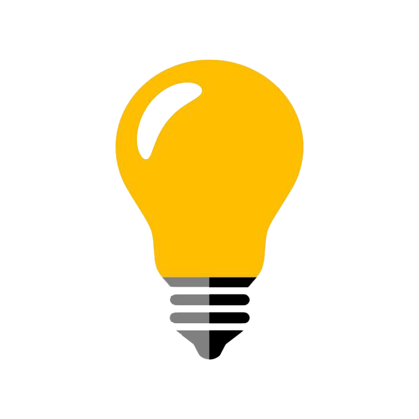

  <p align="center">
    
  </p>
  
  ## :clipboard: Sobre o Projeto
  
  Esta é uma simples página aonde você pode testar a sua lâmpada acendendo é apagando. Este projeto serviu como aprendizado para entender como se usa a atualização de imagens através do JavaScript.
 
  Espero que gostem! 👀
  
  <br>
  <p align="center">
    
  </p>
  <br>

## :computer: Tecnologias utilizadas
  
 O projeto foi desenvolvido utilizando as seguintes tecnologias:
  
 - [HTML](https://developer.mozilla.org/pt-BR/docs/Web/HTML)
 - [CSS](https://developer.mozilla.org/pt-BR/docs/Web/CSS)
 - [JavaScript](https://www.javascript.com/)

## 🕵️‍♂️ Para clonar o repositório utilize:
```bash
 git clone hhttps://github.com/degabrielofi/TesteSuaLampada
```
 ## 


